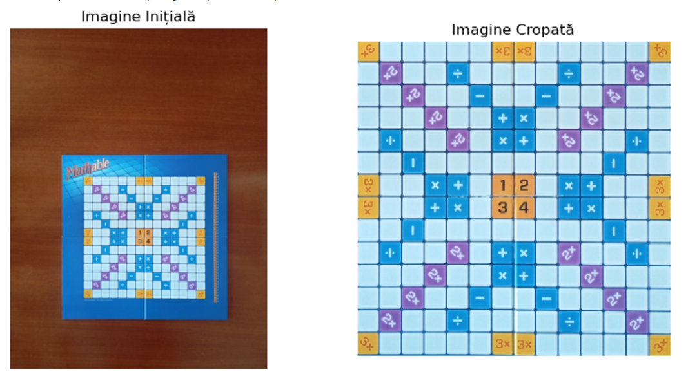

# Mathable Game Solver

## **Project Overview**
This project automates the analysis of a Mathable game board using **computer vision techniques**. It identifies the position of placed tiles, recognizes numbers on them, and computes the score per round.

## **Features**
- **Tile Position Detection:** Identifies where a new tile has been placed on the board.
- **Number Recognition:** Uses template matching to determine the number on the tile.
- **Score Calculation:** Computes and records player scores based on tile values and board bonuses.

## **Technologies Used**
- **Python**
- **OpenCV (cv2)**
- **Skimage (Structural Similarity Index - SSIM)**
- **Numpy**
- **Image Processing Techniques (Filtering, Masking, Binarization)**

## **How It Works**
1. **Board Extraction:** The program filters the board's grid using color segmentation.
2. **Tile Detection:** It compares board images from consecutive rounds to detect changes.
3. **Number Identification:** Template matching is applied to recognize numbers on tiles.
4. **Score Computation:** The program verifies board bonuses (x2, x3) and sums up scores.
